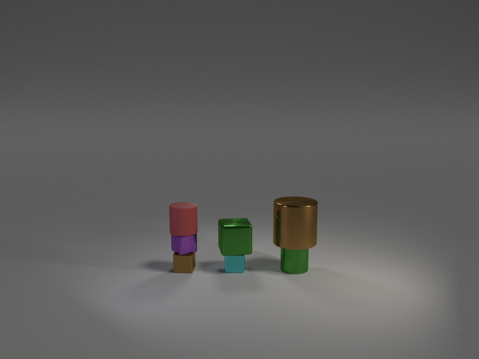

# Photo-Realistic Blocksworld 

This is a repository modified from the [IBM-Repo](https://github.com/ibm/photorealistic-blocksworld) and the  [CLEVR dataset](https://github.com/facebookresearch/clevr-dataset-gen)
for generating realistic visualizations of [blocksworld](https://en.wikipedia.org/wiki/Blocks_world).


Setup:

With anaconda,

```
conda env create -f environment.yml
conda activate prb
```

Install blender:

```
wget https://download.blender.org/release/Blender2.83/blender-2.83.2-linux64.tar.xz
tar xf blender-2.83.2-linux64.tar.xz
echo $PWD > $(echo blender*/2.*/python/lib/python*/site-packages/)clevr.pth
rm blender-2.83.2-linux64.tar.xz
```

Example: Run `./test.sh`.

For the original readme, see [README-clevr.md](README-clevr.md) and [README-ibm.md](README-ibm.md).
=
<div align="center">
  
</div>

# Functionality

+ `render_images.py` : 
  
  Renders random scenes using Blender and stores them into a result directory.
  The directory contains images and metadata.
  This file must be run in the python environment shipped with Blender.

+ `extract_all_regions_binary.py` :

  For a result directory produced by `render_images.py`,
  it extracts the regions from the every images generated, resize them to 32x32 and
  store them in a `.npz` container along with the bounding box vector (x1,y1,x2,y2).
  Optionally, --include-background option resizes and stores the entire image into a `.npz` container in the same format.
  In order to have the same format, all bounding boxes have (0,0,xmax,ymax) values and the number of objects is 1.
  Optionally, --exclude-objects option disables region extraction. When combined with --include-background,
  the resulting archive is merely a compact, resized image format.
  See other options from the source scripts or by runnign the script with no arguments.
  This file must be run in the conda environment.

+ `generate-dataset.sh` :

  Render the dataset. Options are ```[number of objects] [number of transitions] [number of jobs] [use gpu?]```. Example run:
  ```./generate-dataset.sh 5 10 3 1 true``` 

# Running

To generate 10 transitions with 5 objects each. For every state, there are 3 objects and GPU is used:

    ./generate-dataset.sh 5 10 3 1 true

# Citation

``` bibtex
@article{asai2018blocksworld,
	author = {Asai, Masataro},
	journal = {arXiv preprint arXiv:1812.01818},
	title = {{Photo-Realistic Blocksworld Dataset}},
	year = {2018}
}
```

Relevant citations:

``` bibtex
@article{asai2018perminv,
	author = {Asai, Masataro},
	journal = {arXiv preprint arXiv:1812.01217},
	title = {{Set Cross Entropy: Likelihood-based Permutation Invariant Loss Function for Probability Distributions}},
	year = {2018}
}
```

``` bibtex
@inproceedings{asai2019unsupervised,
  title={Unsupervised grounding of plannable first-order logic representation from images},
  author={Asai, Masataro},
  booktitle={Proceedings of the International Conference on Automated Planning and Scheduling},
  volume={29},
  pages={583--591},
  year={2019}
}
```


This repository is based on the clevr-dataset-gen software created by Facebook, Inc.
Copyright (c) 2017-present, Facebook, Inc. All rights reserved.
Licensed under the BSD-3-Clause License. See the LICENSE file for details.

