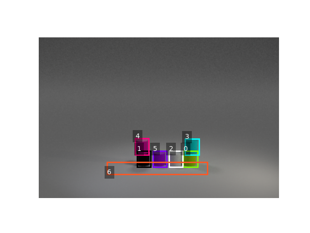
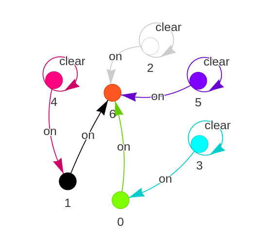

# Photo-Realistic Blocksworld

This repository is a modified version of the [IBM Repo](https://github.com/ibm/photorealistic-blocksworld) and the [CLEVR dataset](https://github.com/facebookresearch/clevr-dataset-gen), designed to generate realistic visualizations of [Blocksworld](https://en.wikipedia.org/wiki/Blocks_world).

## 🚀 Setup

### Using Anaconda:
```bash
conda env create -f environment.yml
conda activate prb
```

### Installing Blender:
```bash
wget https://download.blender.org/release/Blender2.83/blender-2.83.2-linux64.tar.xz
tar xf blender-2.83.2-linux64.tar.xz
echo $PWD > $(echo blender*/2.*/python/lib/python*/site-packages/)clevr.pth
rm blender-2.83.2-linux64.tar.xz
```

### Running an Example:
```bash
./test.sh
```
For the original documentation, refer to [README-clevr.md](README-clevr.md) and [README-ibm.md](README-ibm.md).

<div align="center">
  
</div>

---

## 📌 Functionality

### `render_images.py`
- Generates random scenes using Blender.
- Saves the output images and metadata in a specified directory.
- Must be executed within Blender's Python environment.

### `generate-dataset.sh`
- Automates dataset rendering.
- Usage:
  ```bash
  ./generate-dataset.sh [number_of_objects] [number_of_transitions] [images_per_transition] [jobs] [use_gpu?]
  ```
  Example:
  ```bash
  ./generate-dataset.sh 5 10 3 1 true
  ```

### `generate-and-visualize.sh`
- Generates and visualizes the dataset, including bounding boxes and scene graphs.

---

## 🛠 Running the Script
To generate a dataset with 10 transitions, 5 objects per state, 3 images per state, and GPU acceleration:
```bash
./generate-dataset.sh 5 10 3 1 true
```

---

## 📊 Visualization
To visualize the generated `.json` metadata, use the `visualize_scene_graph.py` script inside the `visualize` directory:

<div align="center">
  
</div>

<div align="center">
  
</div>

---

## 📖 Citation
If you use this dataset, please cite the following paper:

```bibtex
@article{asai2018blocksworld,
  author = {Asai, Masataro},
  journal = {arXiv preprint arXiv:1812.01818},
  title = {{Photo-Realistic Blocksworld Dataset}},
  year = {2018}
}
```

Other relevant citations:
```bibtex
@article{asai2018perminv,
  author = {Asai, Masataro},
  journal = {arXiv preprint arXiv:1812.01217},
  title = {{Set Cross Entropy: Likelihood-based Permutation Invariant Loss Function for Probability Distributions}},
  year = {2018}
}

@inproceedings{asai2019unsupervised,
  title={Unsupervised grounding of plannable first-order logic representation from images},
  author={Asai, Masataro},
  booktitle={Proceedings of the International Conference on Automated Planning and Scheduling},
  volume={29},
  pages={583--591},
  year={2019}
}
```

---

## 📜 License
This repository is based on the CLEVR dataset generator developed by Facebook, Inc.

**Copyright (c) 2017-present, Facebook, Inc.** All rights reserved.
Licensed under the BSD-3-Clause License. See the `LICENSE` file for details.

